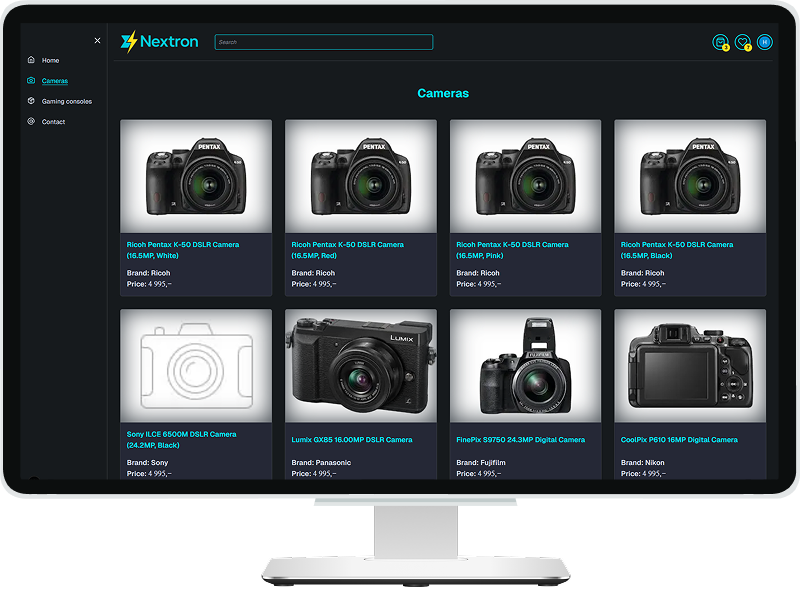

# Project name: 🛒 Nextron
### Project Goal:

 Vise forståelse hvordan man bygger dynamiske nettsider i Next.js med brukertilgang, datalagring, og API-kommunikasjon.

 **🎯 Minimumskrav:**
- Bruke Next.js App Router
- Bruke Clerk for autentisering
- Inneholde minst én API-route
- Implementere CRUD-funksjonalitet
- Bruke asynkron datainnhenting
- Dynamisk routing

*i tillegg:*
- Metadata i layout.jsx,
- Bruk Image komponenten fra next for bilder,
- Sjekk lighthouse observability tool for å sjekke hvor høy score dere får   

## 💎 Description

[](preview.png)

A modern e-commerce platform built with **Next.js 15** + **MongoDB** for seamless client-server separation.

### Overview
Nextron is a simple full-stack online store crafted using the **App Router** in **Next.js v15**, with a clear distinction between **client-side** logic and **server-side** services. The data layer is powered by **Prisma v6.17.1** connecting to a **MongoDB** backend, with a structure that cleanly separates:

- `"services/client"` for client-side API interaction
- `"services/server"` for direct DB access on server-side
- Custom API routes under `/src/app/api/...`
- Pages separated into `(public)` routes and protected `/user` routes using **Clerk** for authentication (but not using the built-in `<SignIn />` and `<SignUp />` components).
- It features products, details, and search.
- Logged-in users can manage a cart, favorites, and simulate purchases.

### 🧩 Tech Stack


<!-- end:tech-stack -->


<!--
<details style="border:1px solid #d4d4d4; border-radius:2px; padding:1rem;">
<summary><h3 style="display:inline; padding-left:6px;">🧩 Tech Stack</h3></summary>

**Framework**


**Authentication / User Management**


**State & Data**


**Forms & Validation**


**UI & Animations**


**Utilities**


</details>
 -->

<details style="border:1px solid #d4d4d4; border-radius:2px; padding:1rem;">
<summary><h4 style="display:inline; padding-left:6px;">🗃 Dependencies</h4></summary>

```bash
npm install -D @trivago/prettier-plugin-sort-imports prettier
npm install --save-dev eslint-plugin-import
npm install react-feather #icons
npm install path-to-regexp #Turn a path (as /user/:name) into a regular expression
npm install clsx #for constructing className strings conditionally
npm install framer-motion
npm install axios
npm install mongodb
npm install @tanstack/react-query
npm install @clerk/nextjs
npm install @clerk/themes
npm install tailwind-merge
npm install react-hot-toast
npm install dotenv #needs for seeding data
npm install @headlessui/react #modal form
npm install zod #validation
npm install react-hook-form @hookform/resolvers
npm install mailgun.js form-data #emails
npm install @clerk/backend #to get user data on the server
```
</details>

<details style="border:1px solid #d4d4d4; border-radius:2px; padding:1rem;">
<summary><h3 style="display:inline; padding-left:6px;">▶️ Getting Started (Prepare & Run)</h3></summary>

### ⚙️ Preparing:

**1. Define admin:**  
- Go to [Clerk dashboard](https://dashboard.clerk.com/) of your application and create the first user manually.
- Then copy this user's **Clerk User ID** and **Primary Email**, and add them to your `.env.local` file as:  `SUPERUSER_CLERK_ID` and  `SUPERUSER_EMAIL`

**2. Required environment variables:**
Create a `.env.local` file in the root of the project add the following:
```env
NEXT_PUBLIC_SITE_URL=http://localhost:3000

# MongoDB
MONGODB_URI= # e.g. mongodb+srv://...
MONGODB_NAME= # your database name

# Admin credentials
SUPERUSER_CLERK_ID= # from Clerk User ID
SUPERUSER_EMAIL= # from Clerk Primary email

# Clerk configuration
NEXT_PUBLIC_CLERK_PUBLISHABLE_KEY=
CLERK_SECRET_KEY=

# Custom auth routes
NEXT_PUBLIC_CLERK_SIGN_IN_URL='/auth?mode=sign-in'
NEXT_PUBLIC_CLERK_SIGN_UP_URL='/auth?mode=sign-up'
```
> [!IMPORTANT] 
💡 add .env.local to .gitignore - don’t commit!

---

### 🚀 Start project:
**1.The first run of the project:** 
```bash
npm run dev
```

**2.After the first run:**

- Open your app in the browser at [http://localhost:3000/api/init-db](http://localhost:3000/api/init-db)
  This will:
  - create required MongoDB collections and indexes
  - create the admin user in the database (using `SUPERUSER_CLERK_ID` and `SUPERUSER_EMAIL`)
   
- Then run the seed script to populate the database with sample data from .json files:
```bash
./src/scripts/seed.js 
```
</details>

---

### 📋 TODO:

#### *functional:*
- [ ] user provider
- [ ] Zod validation DB schemas
- [ ] ? quantity on Product page
- [ ] contact page + check options:
   - [ ] [Send emails with Next.js - Resend](https://resend.com/docs/send-with-nextjs)
   - [ ] [Easy Contact Form to Email Service](https://web3forms.com/)

admin:
- [ ] dashboard page:
   - [ ] ? add/delete product
   - [ ] ? user's role
   - [ ] ? orders

user:
- [ ] shopping card page:
   - [ ] ? quantity

#### *design:*
- [ ] metadata
- [ ] ? react-email Checkout component
- [ ] Logo
- [ ] font color (hover does not work on mobile!)
- [ ] User's buttons break point 480 (menu)
- [ ] Layout:
- [ ] home page
  - [ ] Sidebar
  - [ ] Footer

#### *refactoring:*
- [ ] refactor code:
  - [ ] code lenth <=130 lines
  - [ ] add useful comments
  - [ ] delete unnecessary comments
  - [ ] check if to keep or delete console.log
- [ ] revision file structure of project


<details style="border:1px solid #d4d4d4; border-radius:2px; padding:1rem;">
<summary><h4 style="display:inline; padding-left:6px;">✅ Done</h4></summary>

- [x] pagination
- [x] notFound page
- [x] category page
- [x] registration (clerk?)
- [x] product page
- [x] move from .json files to DB
- [x] add/delete to shopping card
- [x] add/delete to favorites
- [x] change image sizes for adaptive layout
- [x] ToTop button
- [x] favorite page
- [x] search
- [x] form validation (Zod)
- [x] order confirmation(email Mailgun)
- [x] imitation paying process
- [x] Skeleton/Loader
- [x] get user's last order address and autofill form
- [x] user orders page(status,history?)
- [x] FIX BUG: no search result message before result
</details>